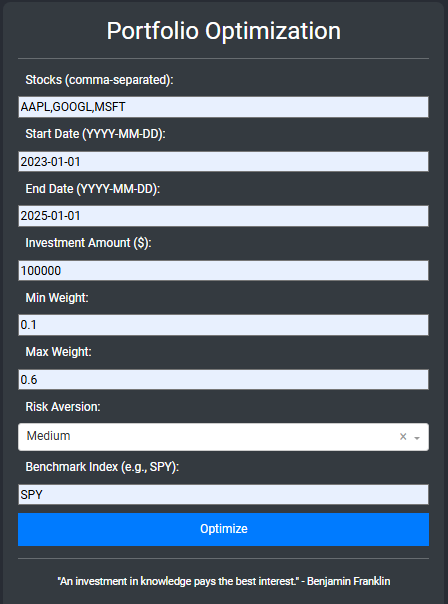
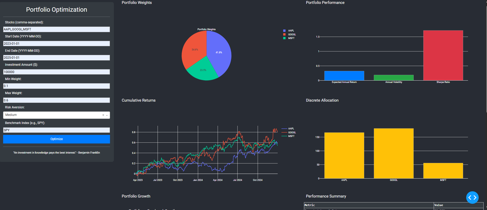
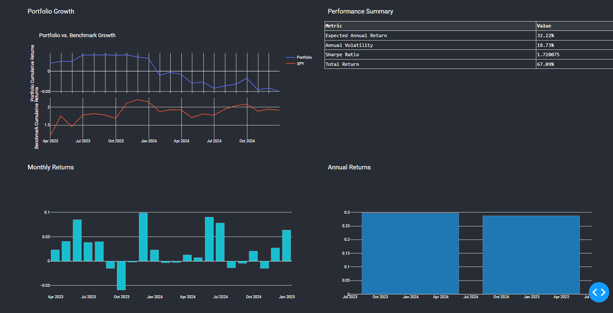

# PortafolioOpt
# Portfolio Optimization Dashboard

This is a Dash-based web application for portfolio optimization. It allows users to input stock tickers, date ranges, investment amounts, and risk parameters to generate an optimized portfolio and analyze its performance against a benchmark.

## Features

-   **Portfolio Optimization:** Utilizes the `pypfopt` library to calculate optimal portfolio weights based on user-defined constraints and risk aversion.
-   **Interactive Visualizations:** Displays portfolio performance through various interactive charts, including:
    -   Portfolio weights pie chart
    -   Portfolio performance bar chart
    -   Cumulative returns line chart
    -   Discrete allocation bar chart
    -   Portfolio vs. benchmark growth subplots
    -   Monthly and annual returns bar charts
-   **Performance Summary:** Provides a summary table with key performance metrics, such as expected annual return, volatility, Sharpe ratio, and total return.
-   **User-Friendly Interface:** A clean and intuitive interface built with Dash and Dash Bootstrap Components.

## Screenshots

### Portfolio Optimization Inputs

*This image shows the sidebar with all the inputs necessary for the portfolio optimization.*

### Portfolio Growth Comparison

*This image shows the portfolio growth comparison with the benchmark using subplots.*

### Portfolio Weights Pie Chart

*This image shows the portfolio weights pie chart.*

**(Replace `path/to/image1.png`, `path/to/image2.png`, and `path/to/image3.png` with the actual paths to your screenshots.)**

## Getting Started

### Prerequisites

-   Python 3.6+
-   pip

### Installation

1.  Clone the repository:

    ```bash
    git clone <repository_url>
    cd <repository_directory>
    ```

2.  Create a virtual environment (recommended):

    ```bash
    python -m venv venv
    source venv/bin/activate  
    venv\Scripts\activate  
    ```

3.  Install the required packages:

    ```bash
    pip install -r requirements.txt
    ```

4.  Set up your Polygon.io API key:

    -   Obtain an API key from [Polygon.io](https://polygon.io/).
    -   Create a `config.py` file in the project root directory.
    -   Add your API key to `config.py`:

        ```python
        API_KEY = "YOUR_POLYGON_API_KEY"
        ```

### Running the App

1.  Start the Dash app:

    ```bash
    python app.py
    ```

2.  Open your web browser and navigate to `http://127.0.0.1:8050/`.


## Usage

1.  Enter the stock tickers (comma-separated) in the "Stocks" input field.
2.  Specify the start and end dates for the analysis.
3.  Enter the investment amount.
4.  Set the minimum and maximum weight constraints for the portfolio.
5.  Choose the risk aversion level.
6.  Enter the benchmark index ticker.
7.  Click the "Optimize" button.
8.  View the generated charts and performance summary.

## Dependencies

-   Dash
-   Dash Bootstrap Components
-   pandas
-   plotly
-   pypfopt
-   requests
-   logging

## Contributing

Feel free to contribute to this project by submitting pull requests or opening issues.
